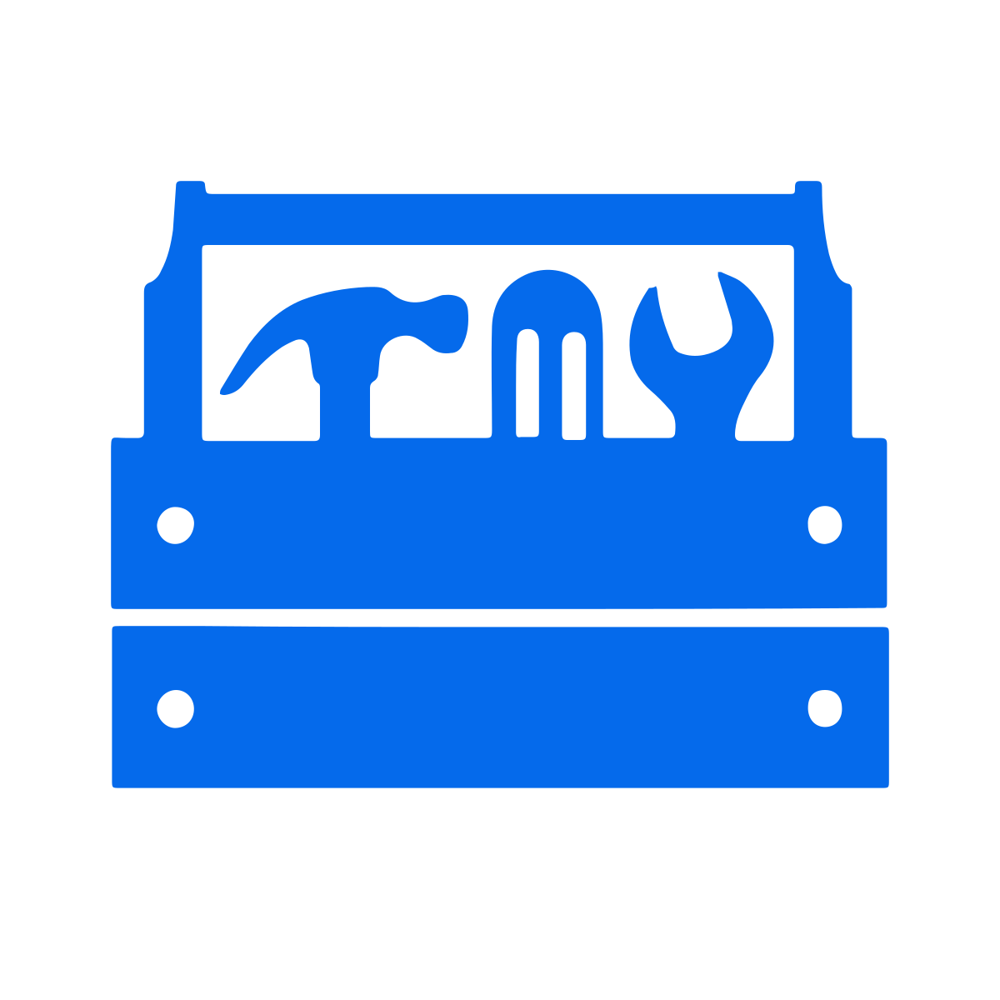
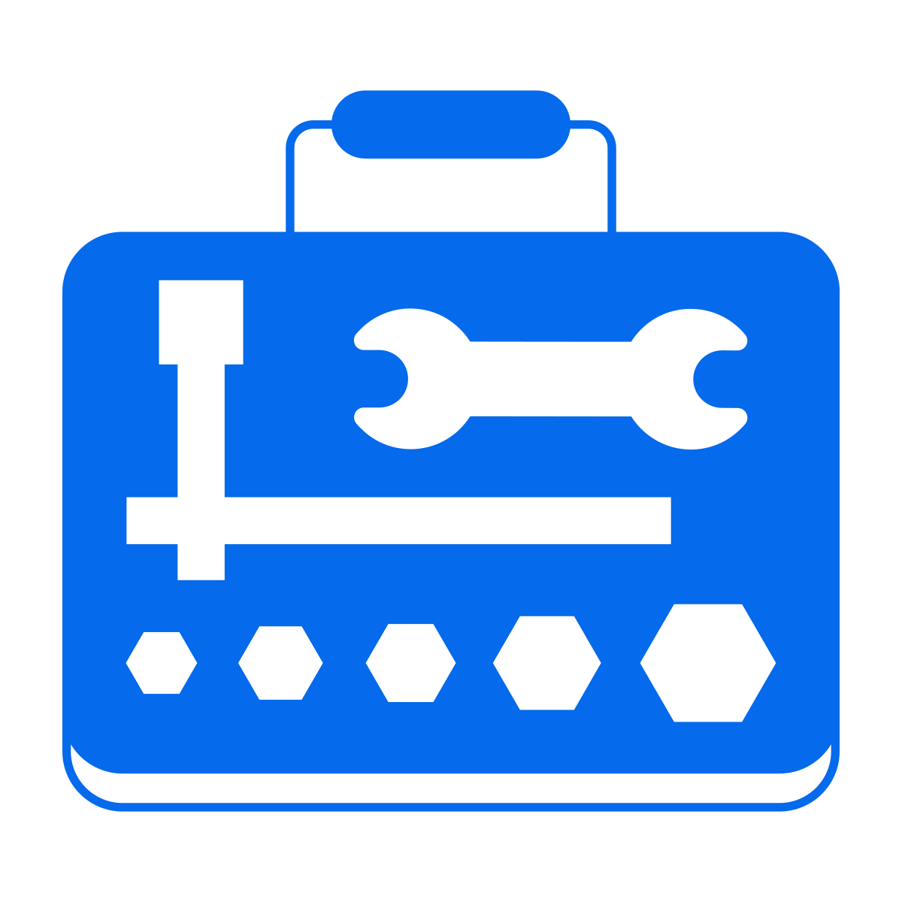

# About Frameworks & Toolkits

## Introduction

Frameworks & Toolkits are proven approaches or principles used to guide / govern a change process.

Typically these focus on the delivery aspects of a product/project. Each framework often 
has a specific version of an activity to specify approaches in a more granular way. We 
have referred to these Activity versions as Framework activities.

## Frameworks

- [Blended Agile Delivery Toolkit (BAD)](BAD)
- [Scrum Framework](scrum)

etc...