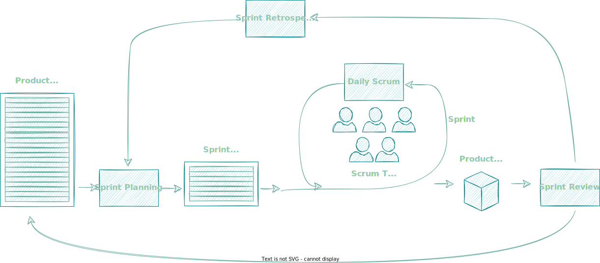

# The Scrum Framework

:::caution
This guide is based on the November 2022 Scrum Guide[^1].  It is not designed to replace the Scrum Guide, but rather provide an interpretation of it as well as additional narrative and guidance.
:::

Scrum was developed in the early 1990s by [Jeff Sutherland](https://scrumguides.org/jeff.html) and [Ken Schwaber](https://scrumguides.org/ken.html).  The original version of the Scrum Guide (the basis for Scrum) was written in 2010, in order to support the adooption of Scrum.

The Scrum Framework is designed to help Agile delivery teams become more effective, collaborate and offer transparency and clarity to stakeholders.

The [Scrum Guide](https://scrumguides.org/)[^1] contains the definition of Scrum and is constantly evolving / under review.

## Scrum Definition

Scrum is a lightweight framework that helps people, teams and organizations generate value through adaptive solutions for complex problems.

In a nutshell, Scrum requires a [Scrum Master](../Challenges/Roles%20and%20Responsibilities/Scrum%20Team#scrum-master) to foster an environment where:

1. A [Product Owner](../Challenges/Roles%20and%20Responsibilities/Scrum%20Team#product-owner) orders the work for a complex problem into a [Product Backlog](../Challenges/Transparency%20and%20measurement/Scrum%20Artifacts#product-backlog).
2. The [Scrum Team](../Challenges/Roles%20and%20Responsibilities/Scrum%20Team) turns a selection of the work into an Increment of value during a Sprint.
3. The [Scrum Team](../Challenges/Roles%20and%20Responsibilities/Scrum%20Team) and its stakeholders inspect the results and adjust for the next Sprint.
4. Repeat

Scrum is simple. Try it as is and determine if its philosophy, theory, and structure help to achieve goals and create value. The Scrum framework is purposefully incomplete, only defining the parts required to implement Scrum theory. Scrum is built upon by the collective intelligence of the people using it. Rather than provide people with detailed instructions, the rules of Scrum guide their relationships and interactions.

Various processes, techniques and methods can be employed within the framework. Scrum wraps around existing practices or renders them unnecessary. Scrum makes visible the relative efficacy of current management, environment, and work techniques, so that improvements can be made.

_&copy; The Scrum Guide November 2020[^1]_

## Motivation behind Scrum

Scrum was founded to provide an evidence (or empirical) process, leveraging Lean thinking.  To be evidence based, we much learn from the past and mack decisions based on those observations.  Lean focuses on the reduction of waste as well as the focus on continuous improvement.

The framework is iterative (in that it uses repeated fixed time-boxes or iterations, called Sprints, to provide a structure that can be easily repeated) and incremental, in that, at the end of each iteration (Sprint), a new Product Increment is created, adding value beyond the previous iteration (Sprint).

This iterative and incremental approach allows team to optimise their delivery and provide significantly improved predictability and risk control.

Scrum utilises a formal events structure to ensure transparency, inspection and adaptation:

* **Transparency** - Make all work visible to those doing the work and receiving the work
* **Inspection** - Inspect frequently and robustly to ensure that undesirable variances and problems are discovered and resolved
* **Adaptation** - Providing the team with autonomy to correct unwanted deviations and experiment to improve the team's delivery

## Values

Scrum has five core values:

* **Commitment** - The team commit to iteration (Sprint) goals.  This includes committing to each other to provide the necessary support to meet these goals
* **Focus** - The team focus on the goals of the iteration (Sprint) to the exclusion of all other distractions
* **Opeenness** - Be honest and transparent in the challenges, uncertainty, variances and risks associated with delivery
* **Respect** - Respect each other, ensuring autonomy and support when needed
* **Courage** - Have courage to always do the right thing and to resolve tough problems

## More about Scrum

* [Scrum Team](../Challenges/Roles%20and%20Responsibilities/Scrum%20Team)
* [Scrum Events](../Challenges/Team%20Co-ordination/Scrum%20Events)
* [Scrum Artifacts](../Challenges/Transparency%20and%20measurement/Scrum%20Artifacts)

## Scrum Playbooks

[todo]

## Scrum Tools

* [Scrum in Confluence](/docs/Tools/Scrum/Scrum%20Confluence)
* [Scrum in Jira](/docs/Tools/Scrum/Scrum%20Jira)

[^1]: [The Scrum Guide](https://scrumguides.org/)
